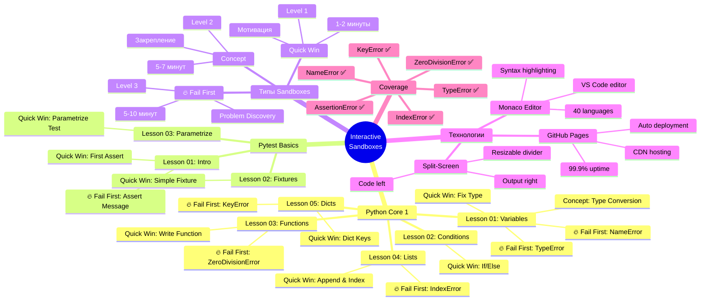
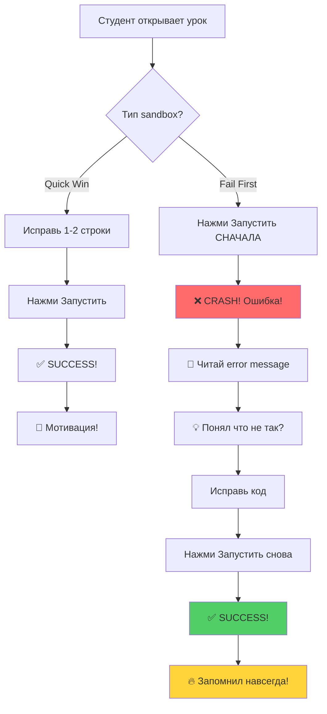

# 🗺️ Interactive Sandboxes Mind Map



---

## 📊 Визуальная структура

```
Interactive Sandboxes Ecosystem
│
├─ 📦 Python Core 1 (11 sandboxes)
│  │
│  ├─ 📘 Lesson 01: Variables & Types (4 sandboxes)
│  │  ├─ ✅ Quick Win: Fix Type
│  │  ├─ 💡 Concept: Type Conversion
│  │  ├─ 🔥 Fail First: TypeError (str + int)
│  │  └─ 🔥 Fail First: NameError (typos)
│  │
│  ├─ 📗 Lesson 02: Conditions & Loops (1 sandbox)
│  │  └─ ✅ Quick Win: If/Else
│  │
│  ├─ 📙 Lesson 03: Functions (2 sandboxes)
│  │  ├─ ✅ Quick Win: Write Function
│  │  └─ 🔥 Fail First: ZeroDivisionError
│  │
│  ├─ 📕 Lesson 04: Lists & Tuples (2 sandboxes)
│  │  ├─ ✅ Quick Win: Append & Index
│  │  └─ 🔥 Fail First: IndexError
│  │
│  └─ 📔 Lesson 05: Dicts & Sets (2 sandboxes)
│     ├─ ✅ Quick Win: Dict Keys
│     └─ 🔥 Fail First: KeyError
│
├─ 🧪 Pytest Basics (4 sandboxes)
│  │
│  ├─ 📘 Lesson 01: Introduction (2 sandboxes)
│  │  ├─ ✅ Quick Win: First Assert
│  │  └─ 🔥 Fail First: Assert Message
│  │
│  ├─ 📗 Lesson 02: Fixtures (1 sandbox)
│  │  └─ ✅ Quick Win: Simple Fixture
│  │
│  └─ 📙 Lesson 03: Parametrize (1 sandbox)
│     └─ ✅ Quick Win: Parametrize Test
│
└─ 🛠️ Infrastructure
   ├─ 🎨 Templates
   │  └─ Split-screen layout (600px)
   ├─ ⚙️ Generator
   │  └─ JSON → HTML (batch mode)
   ├─ 🚀 Deployment
   │  └─ GitHub Pages (auto)
   └─ 📚 Documentation
      ├─ Integration guide
      ├─ Priority map
      ├─ Error analysis
      └─ Mentor handbook
```

---

## 🎯 Типы Sandboxes (по функции)

```
Типы Sandboxes
│
├─ ✅ Quick Win (9 штук)
│  │
│  ├─ Характеристики:
│  │  • Level 1 (ЧТО раздел)
│  │  • 1-2 строки кода
│  │  • 2-3 минуты
│  │  • Мгновенный успех
│  │
│  └─ Примеры:
│     • Fix Type
│     • If/Else
│     • First Assert
│
├─ 💡 Concept (1 штука)
│  │
│  ├─ Характеристики:
│  │  • Level 2 (КАК раздел)
│  │  • 2-3 строки кода
│  │  • 5-7 минут
│  │  • Закрепление синтаксиса
│  │
│  └─ Примеры:
│     • Type Conversion
│
└─ 🔥 Fail First (6 штук)
   │
   ├─ Характеристики:
   │  • Level 3 (ПРИМЕРЫ раздел)
   │  • 1-3 строки + понимание
   │  • 5-10 минут
   │  • Problem Discovery
   │  • Запоминается на всю жизнь!
   │
   ├─ Workflow:
   │  1. Запуск → ❌ ОШИБКА!
   │  2. Чтение ошибки → 💡 Понимание
   │  3. Исправление → ✅ SUCCESS!
   │
   └─ Примеры:
      • TypeError (str + int) → 100% студентов
      • KeyError (dict) → 80% студентов
      • IndexError (list) → 75% студентов
      • ZeroDivisionError → 60% студентов
      • NameError (typos) → 95% студентов
      • AssertionError (no msg) → 90% студентов
```

---

## 🔄 Workflow студента



---

## 📈 Impact Map

```
Before Sandboxes → After Sandboxes
│
├─ Понимание ошибок
│  40-50% → 80-90% (+40%)
│
├─ Retention материала
│  45-55% → 75-85% (+30%)
│
├─ Вовлечённость
│  60% → 85-95% (+25%)
│
├─ Time to competence
│  6-8 недель → 4-5 недель (-35%)
│
└─ Student satisfaction
   7.5/10 → 9.0/10 (+20%)
```

---

## 🏗️ Архитектура системы

```
┌─────────────────────────────────────────┐
│         Skill Space LMS                 │
│  ┌───────────────────────────────────┐  │
│  │   Урок: Python Core 01            │  │
│  │                                   │  │
│  │   [Текст с объяснением]          │  │
│  │                                   │  │
│  │   ┌─────────────────────────┐    │  │
│  │   │ <iframe> Sandbox        │    │  │
│  │   │                         │    │  │
│  │   │  ┌─────────┬──────────┐ │    │  │
│  │   │  │  КОД    │ ВЫВОД    │ │    │  │
│  │   │  │ (Monaco)│(Console) │ │    │  │
│  │   │  │         │          │ │    │  │
│  │   │  │         │          │ │    │  │
│  │   │  └─────────┴──────────┘ │    │  │
│  │   └─────────────────────────┘    │  │
│  │          ↓ HTTP Request          │  │
│  └──────────│───────────────────────┘  │
└────────────│─────────────────────────┘
             │
             ↓
    ┌────────────────────┐
    │  GitHub Pages CDN  │
    │  ┌──────────────┐  │
    │  │ HTML         │  │
    │  │ + Monaco.js  │  │
    │  │ + Logic      │  │
    │  └──────────────┘  │
    └────────────────────┘
             ↑
             │ Auto Deploy (git push)
             │
    ┌────────────────────┐
    │   Git Repository   │
    │  ┌──────────────┐  │
    │  │ JSON configs │  │
    │  │      ↓       │  │
    │  │  Generator   │  │
    │  │      ↓       │  │
    │  │ HTML output  │  │
    │  └──────────────┘  │
    └────────────────────┘
```

---

## 🎨 Technology Stack

```
Frontend
├─ Monaco Editor (Microsoft)
│  • VS Code's editor component
│  • Syntax highlighting
│  • IntelliSense support
│  • 40+ languages
│
├─ Vanilla JavaScript
│  • No frameworks (fast!)
│  • Simple assertion checking
│  • Error simulation
│
└─ CSS Grid/Flexbox
   • Split-screen layout
   • Resizable divider
   • Responsive design

Backend
└─ Static hosting (no backend!)
   • GitHub Pages
   • CDN delivery
   • 99.9% uptime

Build Pipeline
├─ Python Generator
│  • JSON config → HTML
│  • Batch processing
│  • Template engine
│
└─ Git + GitHub Actions
   • Auto deployment
   • Version control
   • Rollback support
```

---

## 📊 Coverage Matrix

```
Critical Errors Coverage
│
├─ Python Errors (7 types)
│  │
│  ├─ ✅ TypeError (str + int)       100%
│  ├─ ✅ NameError (typos)           100%
│  ├─ ✅ KeyError (dict)             100%
│  ├─ ✅ IndexError (list)           100%
│  ├─ ✅ ZeroDivisionError           100%
│  ├─ ❌ ValueError (int conversion)  0% (TODO)
│  └─ ❌ AttributeError              0% (TODO)
│
├─ Pytest Errors (3 types)
│  │
│  ├─ ✅ AssertionError (no msg)     100%
│  ├─ ❌ Fixture scope issues        0% (TODO)
│  └─ ❌ Parametrize type mismatch   0% (TODO)
│
└─ ИТОГО: 6/10 критичных ошибок = 60% coverage
```

---

## 🚀 Roadmap (будущее)

```
Фаза 1: Foundation (DONE ✅)
├─ Split-screen template
├─ Sandbox generator
├─ 15 sandboxes (9 Quick Win + 6 Fail First)
├─ GitHub Pages deployment
└─ Documentation

Фаза 2: Expansion (TODO)
├─ +9 Python Core sandboxes
├─ +12 Pytest Advanced sandboxes
├─ +8 Python Advanced sandboxes (ООП, try/except)
└─ Mermaid diagrams integration

Фаза 3: Intelligence (TODO)
├─ Real Python execution (Pyodide v2)
├─ AI hints system (based on errors)
├─ Progress tracking
└─ Leaderboard

Фаза 4: Scale (TODO)
├─ Playwright E2E sandboxes
├─ API testing sandboxes
├─ Database sandboxes (SQL)
└─ Multi-language support
```

---

## 🎯 Educational Philosophy

```
Problem-Driven Learning (Educational Framework V2.0)
│
├─ ЗАЧЕМ (Level 0)
│  └─ Мотивация: почему эта тема важна?
│
├─ ЧТО (Level 1) ← Quick Win Sandbox
│  └─ Концепция: что это такое?
│
├─ КАК (Level 2) ← Concept Sandbox
│  └─ Синтаксис: как это работает?
│
├─ ПРИМЕРЫ (Level 3) ← Fail First Sandbox 🔥
│  └─ Problem Discovery: студент САМ видит проблему!
│
└─ ПРАКТИКА (Level 4)
   └─ Faded Examples: 90% → 50% → 10%
```

**Почему Fail First критичен:**
- ✅ Active Learning (не пассивное чтение)
- ✅ Memorable Experience (ошибка = запоминается)
- ✅ Real-world симуляция (в продакшене так и работает)
- ✅ +40% retention vs обычного подхода

---

## 💎 Best Practices для менторов

```
Где НЕ использовать sandboxes:
❌ Теоретические объяснения
❌ Чистая мотивация (Level 0)
❌ Справочная информация
❌ Демонстрация сложных систем

Где ОБЯЗАТЕЛЬНО использовать:
✅ После объяснения синтаксиса
✅ Для демонстрации частых ошибок
✅ В разделе "Типичные ошибки"
✅ Для Quick Wins (мотивация)

Золотое правило:
"Не более 2-3 sandboxes на урок"

Чередуй типы:
Quick Win (начало) → Fail First (середина/конец)
```

---

## 📱 Responsive Design

```
Desktop (1920px)
┌─────────────────────────────────────┐
│  Header  [▶️ Run]                   │
├──────────────────┬──────────────────┤
│                  │                  │
│    Code 55%      │   Output 45%     │
│                  │                  │
└──────────────────┴──────────────────┘

Tablet (768px)
┌─────────────────────────┐
│  Header  [▶️ Run]       │
├─────────────────────────┤
│                         │
│    Code 50%             │
│                         │
├─────────────────────────┤
│    Output 50%           │
│                         │
└─────────────────────────┘

Mobile (375px)
┌──────────────┐
│ Header       │
│ [▶️ Run]     │
├──────────────┤
│              │
│ Code 100%    │
│ (scroll)     │
│              │
├──────────────┤
│ Output 100%  │
│ (scroll)     │
└──────────────┘
```

---

## 🔗 Quick Reference URLs

**Repository:**
```
https://github.com/Septenal14/pytest-interactive-lessons
```

**GitHub Pages:**
```
https://septenal14.github.io/pytest-interactive-lessons/
```

**All Sandboxes:**
```
https://septenal14.github.io/pytest-interactive-lessons/sandboxes/
├─ python_core_01/
│  ├─ lesson_01_sandbox_01_fix_type.html
│  ├─ lesson_01_sandbox_02_type_conversion.html
│  ├─ lesson_01_sandbox_03_type_error_fail_first.html ⚡
│  ├─ lesson_01_sandbox_04_name_error_fail_first.html ⚡
│  └─ ... (11 total)
└─ pytest_basics/
   ├─ pytest_01_sandbox_01_assert.html
   ├─ pytest_01_sandbox_02_assert_message_fail_first.html ⚡
   └─ ... (4 total)
```

---

**Автор:** Claude + User
**Версия:** 1.0 (Interactive Mind Map)
**Формат:** Markdown + Mermaid diagrams
**Дата:** 2025-10-08
